# Document Intelligence

## Introduction

Document Intelligence is a machine learning (ML) solution that provides assistance to quickly and accurately extract information from documents to the Now Platform® enabling you to quickly process highly variable documents that change over time.

Many organizations today use simple optical character recognition (OCR) solutions to extract data from documents that requires significant manual configuration, and also often requires manual changes as the documents evolve. Document Intelligence extends beyond the simple OCR by using ML to identify, understand, and extract text and data from documents. This enables you to accurately automate document processing and accurately extract information from documents, even when the documents have varied text, data, and templates. 

We added this capability on the platform so the data extraction from documents can easily be done but also for our customer to be able to do this from within their own Workflows on the platform. A lot of processes still involve digital documents, this can be a useful capability as organisation are progressing on their hyperautomation journey.

## Goal

In this exercise we are going over a use case of a fictitious organization called **ACME**. ACME is growing very fast and hiring a lot of new employees. The HR team has submitted an Automation request in Automation Center to automate the Onboarding process of new hire. ACME's Automation COE has agreed to automate that process and use Document Intelligence to  add some automation. One step of this process is called **Setup Direct Deposit**. We are going to focus for this exercise on this part. The current process is manual and done via email. Payroll Operation team request the employee to submit a **VOID Check** via email, then upon reception of that email Payroll manually extracts the banking information from the VOID Check and has to perform data entry operations with that data to setup the direct deposit for the new employee. In this exercise we are going to review how this the data extraction can be automated, and in the following exercise we will see how we can automate the Data Validation and Data Entry for this data using Integration Hub and RPA Hub.

1. Log in to your instance as **Admin**

     We are going to Impersonate as **Abel Tuter**, for our use case, **Abel Tuter** is a new hire will submit his VOID Check using a **Record Producer** in ServiceNow. This step will allow you to review the document for which we want to extract information, but also it shows an example of how you can submit document to **Document Intelligence**. 

    > Document Intelligence can grab documents from attachment on any records. Documents can be submitted to DocIntel via a workflow too.

1. Once logged-in to your instance as **Admin**, click on the **Favorites** (1) then click on **Download the VOID Cheque here** (2) :

    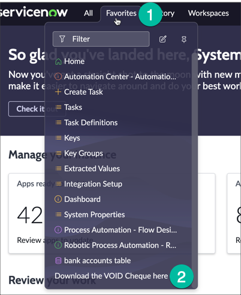

1. The download of the of file should start automatically. In your Download folder locate the file name **void cheque Abel Tuer.jpg** and open it so we can review the information we want to extract from it.

    This this an example of VOID Check that payroll will use to extract the banking information of the new hire. On the VOID Check there are meaningful information that they usually extract manually:

    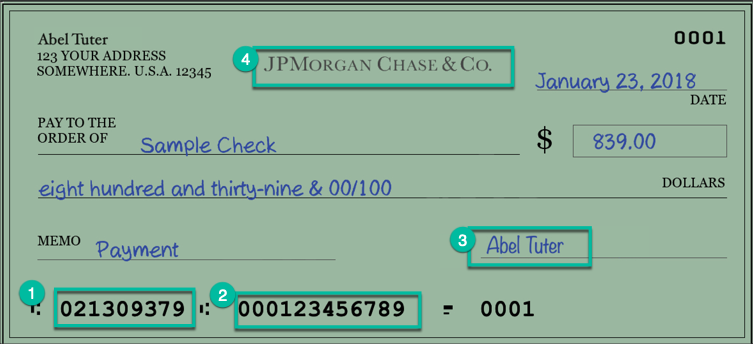

    | Text Element| Value |
   |-------|-------|
   | 1. Routing Number | 021309379 |
   | 2. Account Number | 000123456789 |
   | 3. Account holder | Abel Tuter |
   | 4. Bank Name | JPMorgan |

    > Later in the exercise we will review how we have configured and trained **Document Intelligence** to extract those informations.

1. In order to show you how we can submit documents to DocIntel we are going to impersonate as *****Abel Tuter** and submit the VOID Check like an new hire would do. 

1. Click on the profile picture on the top right corner (1), then click **Impersonate user**:

    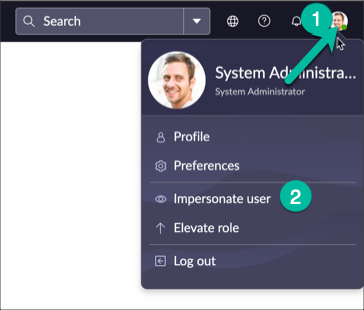

1.  In the **Impersonate user** screen, type **Abel Tuter** in search box (1), then click on **Abel Tuter** (2)  and finally click **Impersonate user** (3)

    

1. Once impersonated as **Abel Tuter**, click **Favorites** (1) then click **Setup Direct Deposit** (2)

    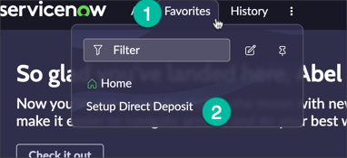

    > This is just a shortcut to open the Recored Producer that we have created for new hires to submit their VOID Check.
1. Once the **Setup Direct Deposit** record producer is opened, click **Add attachments** (1), select the file **void cheque Abel Tuter.jpg** from your download folder then click **submit** (2)

    

1. Notice a banking record was created, record number **BAN0001001**. For our use case this would trigger **Document Intelligence** to process the file that is attached to the record to perform the data extraction.

1. Now we are going to end the impersonation for **Abel Tuter** and inspect what is happening in the back-end and how **Document Intelligence** was configured.

1. Click on **Abel Tuter**'s profile picture (1) then click **End  impersonation** (2)

    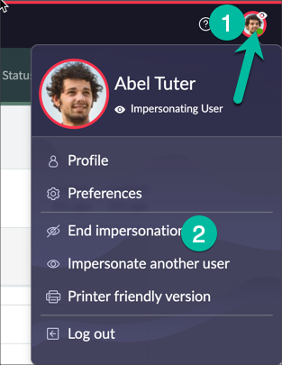

1. Click **All** (1) then type **ml_solution.list** (2) then press **Enter**:
    
    

    >Note: This is where you can see Document Intelligence sending jobs to our Machine Learning shared infrastructure (Nagini) to process documents (OCR Task, Training the model and retreive the predicted values). We just want to show here what is happening in the back-end. It can be useful for the ServiceNow Admin or Document Intelligence admin to look at this table to see how long it takes to process the Document intelligence tasks. Since Document Intelligence uses a shared Machine Learning infrastructure, it can takes from few seconds to minutes to process depending of the workload on the Nagini cluster.

1. You should see a table and records as shown in the example below. Other ServiceNow products write on that table, for example **Predictive Intelligence**.

    

1. We are going to view what we have configured on the instance in order for Document Intelligence to extract the information we need from that VOID Check. Click on **All** (1) then type **Document intelligence** in the filter navigator (2) and finally click **Task Definititions**:

    

    > The task definition is where you tell to Document Intelligence about a new type of document you need to process.

1. Click on the **Void check - Task Definition** record to open it:

     

1. Lets review the **Task Definition** for our use case (Extracting data from VOID checks), that screen **Task Definition** is basically the only configuration screen needed to get started with the product. 

    >Notice the field **Target table** (1) . this is where we tell Document Intelligence for which table we are going to use the values extracted from the document.

    >Notice the option **Enable Straight Through Processing** (2), you can enable that option so AI automatically extracts the data for all fields, if the confidence threshold for all fields is above the Straight Through Processing Threshold defined in the task definition. Fields do not need to be reviewed, otherwise you can have an agent that would review the values extracted, after values are reviewed the Machine Learning model associated to that Task Definition is re-trained automatically. DocIntel becomes more confident over time, as it processes more and more documents. 

    > Notice the tab **Keys** (3), this is where we have defined the elements we want to extract the document.

    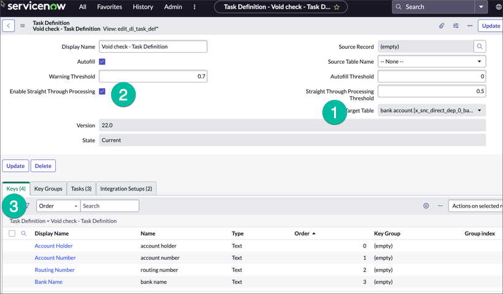

1. Under the **Keys** tab, click **Account Holder** (2) to open that **Key**:

    

    > When you need Document Intelligence to extract certain elements from a document, you create new keys on the Task Definition.

1. Notice the **Display Name** field (1), this is the name for the new key, then the **Type** field (2), it can be Text or True/Fasle (for check box on forms for example). What you define on the **Target Field** field (3) is the field on which you want to store the value extracted by **Document Intelligence** on a record. **Target Table** (4) is the name of the table that contain the records you need to update with the value extracted (It's also the table that contains the records with the document attached that Document Intelligence will process):

    

1. Click the back button on the Key record to return to the **task definition** screen

    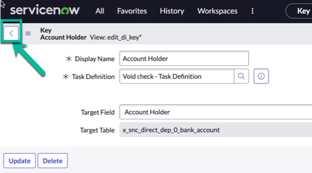

1. From the **Task Definition** screen, click on the **Tasks** tab (1).

    > Every time you need DocIntel to process a document, you need to create a task. And request to DocIntel to process that task.  The creation of the task (and trigger) can be automated via workflow. we will cover that shortly.

    Locate the Task named **Void check - Process task** (2), then notice the value **true** (3) on the **Is Straight Through Processed** column. It means that automatically extracted the data for all fields (without any human intervention). Notice on the column **Source Record** (4). For that task Document Intelligent has processed the attachment from that banking record **BAN0001032** and has populated the fields defined with the keys we have reviewed in the previous step.

    Click on the **Void check - Process task** task (2) to open it

    

1. Once the task screen is open, notice the **Extracted Values** (1), those are the values that Document Intelligence has extracted from the VOID Check automatically.
Click on the **Show In Doctintel** button (2) to open the file in DocIntel:

    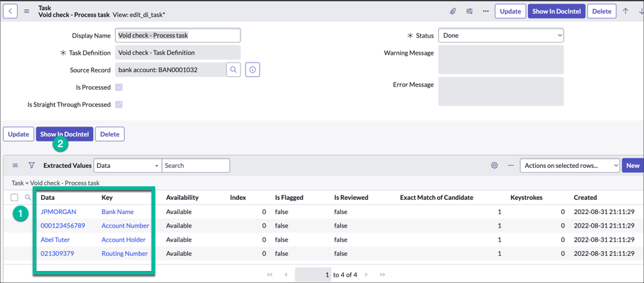

1. Agents usually open a document in Document Intelligence to review and validate the extracted value or to map extracted values to the keys (to train the model). The first time you submit a task associated to a new **Task Definition**, DocIntel won't know which values go to which key. The Machine Learning model needs to be trained. We do this by clicking on the key field (1) and selecting the correct value. The sytem indicates on the screen from where the value is coming from in the document (2). 

    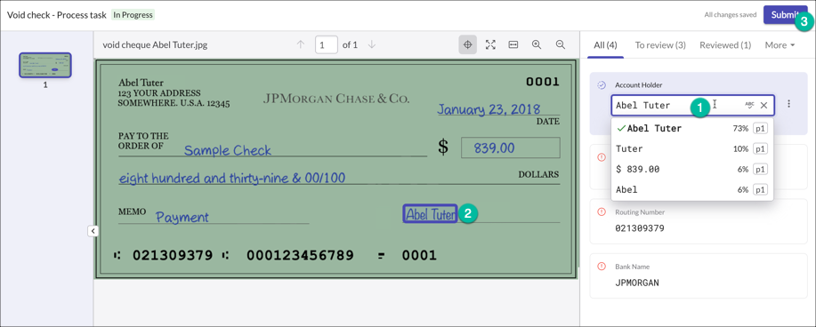

    Notice the percentage number (73%) next to **Abel Tuter** under the **Account Holder** field (1). This is the confidence score for the prediction. The confidence score increases as you train the model with more document (usually 4 to 5 documents is enough to reach high number).  On the Task definition you can configure the **Straight Through processing threshold**. this correspond to the predicition confidence score value for which you want to extract the values and map them to the fields without a manual review from an agent.

    Click the **Submit** button.  By clicking the submit button the model is trained with those new inputs. In this Lab environment we do not have access to our Machine Learning component it won't do anything. You can now close that Tab.

1. Remember, we have submitted a VOID Check as **Abel Tuter**, you might wonder how the Bank Record with the attachment was picked up automtically by DocIntel. Let's review what was configured to do this. 

1. Return to the Task Definition that was created for that use case. Click on **All** (1) then type **Document intelligence** in the filter navigator (2) and finally click **Task Definititions**:

    

1. Click on the **Void check - Task Definition** record to open it:

     

1. Once the **Task definition** is opened, Click on the **Integration Setups** Tab and open the record **Void check - Process task** (1) 
    > This is where you go to configure DocIntel to Process tasks automatically when records are created or updated with attachment on the defined **Target Table**.
    The first record **Void Check - Process task** (1), is where we have configured DocIntel to process a task based on our own condition (It uses a workflow). the second record **void check- extract values** is where we enable the workflow that is going to take the extracted values and assign them to the target fields that we have mapped when we have defined the **Keys**. Both of those workflows are created automatically by DocIntel but you can create your own if you need to perform additional steps.

    

1. Under  **Conditions** (1) This is where you configure the conditions for DocIntel to process specific records (pick up an attachment from specific records that match that condition). 

    Notice the option **Create flow** (2). If selected, DocIntel will automatically create the flows that will be used to create the DocIntel tasks and Process them.

    **Trigger** (3) and **Flow Conditions** (4) are automatically created, this what you will see if you open the specifc Flow in Flow Designer, it correspond the the Flow trigger and flow condition in flow designer. 

    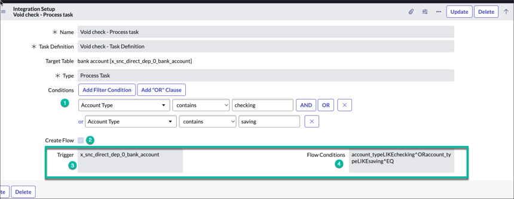

1. We have reviewed all the configurations that was done for that particular use case.  Lets review the outcome of that automated data extraction from DocIntel.

    Click on **Favorites** (1) then **bank account table** (2)

    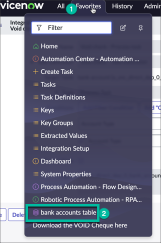

    When we origininally submitted the VOID Check as **Abel Tuter** a bank record was automatically created. Then based on the configuration of DocIntel, a DocIntel task was created automatically to process the attachment (VOID Check), extract the data then update the field Account Number, Bank Name, Routing Number, Account Holder.  In this Lab environment we cannot process documents since we do not have access to our shared ML Infrastructure from those instances but we are showing on this screen below the end result with data we have preloaded on the lab instance so you can see what it would look like in real life...

    

    > This is a lab exercise, in real life we would not show any sensitive information like those banking information. We have created a custom table just for that exercise and securing the data is not the focus of that lab. We have different encryptions capabilities on the platform if we wanted to secure that data :-) 

In the following  exercice (IntegrationHub we see how to build a spoke to integrate ServiceNow to an external API that will use those extracted information from DocIntel.

## Conclusion

In this **Document Intelligence** lab, we have covered how Document Intelligence can be configured to extract information from structured or semi-structed documents. We have seen how you can use those extracted values from within a workflow. In the following exercice, we are covering how to build a flow and integration using IntegrationHub to perform data validation (with the data extracted via DocIntel). You will learn how to build a spoke to integrate ServiceNow to an external system via API. 
