# Document Intelligence

## Introduction

Document Intelligence is a machine learning (ML) solution that provides assistance to quickly and accurately extract information from documents to the Now Platform® enabling you to quickly process highly variable documents that change over time.

Many organizations today use simple optical character recognition (OCR) solutions to extract data from documents that requires significant manual configuration, and also often requires manual changes as the documents evolve. Document Intelligence extends beyond the simple OCR by using ML to identify, understand, and extract text and data from documents. This enables you to accurately automate document processing and accurately extract information from documents, even when the documents have varied text, data, and templates. 

We added this capability on the platform so the data extraction from documents can easily be done but also for our customer to be able to do this from within their own Workflows on the plateform. A lot of processes still involve digital documents, this can be a useful capability as organisation are progressing on their hyperautomation journey.

## Goal

In this exercice we are going over a use case of a fictitious organization called **ACME**. ACME is growing very fast and hiring a lot of new employees. The HR team has submitted an Automation Idea in Automation Center to automate the Onboarding process of new hire. ACME's Automation COE has agreed to automate that process and use Document Intelligence to help with automate. One part of step of this process is called **Setup Direct Deposit**. We are going to focus for this exercice on this part. The current process is manual and done via email. Payroll Operation team request the employee to submit a **VOID Check** via email, then upon reception of that email Payroll manually extracts the banking information from the VOID Check and has to perform data entry operations with that data to setup the direct deposit for the new employee. In this exercice we are going to review how this the data extraction can be automated, and in the following exercice we will see how we can automate the Data Validation and Data Entry for this data.

1. Log in to your instance as **Admin**

     We are going to Impersonate as **Abel Tuter**, for our use case, **Abel Tuter** is a new hire will submit his VOID Check using a **Record Producer** in ServiceNow. This step will allow you to review the document for which we want to extract information, but also it shows an example of how you can submit document to **Document Intelligence**. 

    > Document Intelligence can grab documents from attachment on any records. Documents can be submitted via a workflow too.

1. Once logged-in to your instance as **Admin**, click on the **Favorites** (1) then click on **Download the VOID Cheque here** (2) :

     

1. The download of the of file should start automatically. In your Download folder locate the file name **void cheque Abel Tuer.jpg** and open it so we can review the information we want to extract from it.

    This this an example of VOID Check that payroll will use to extract the banking information of the new hire. There are meaningful information that hey usually extract manually:

     

    | Text Element| Value |
   |-------|-------|
   | 1. Routing Number | 021309379 |
   | 2. Account Number | 000123456789 |
   | 3. Account holder | Abel Tuter |
   | 4. Bank Name | JPMorgan |

    > Later in the exercice we will review how we have configured and trained **Document Intelligence** to extract those informations.

1. Click on the profile picture on the top right corner (1), then click *Impersonate user**

    > We are going to submit the VOID Check in ServiceNow as **Abel Tuter**

     

1.  In the **Impersonate user** screen, type **Abel Tuter** in search box (1), then click on **Abel Tuter** (2)  and finally click **Impersonate user** (3)

     
)

1. Once impersonated as **Abel Tuter**, click **Favorites** (1) then click **Setup Direct Deposit** (2)

    

    > This is just a shortcut to open the Recored Producer that we have created for new hires to submit their VOID Check.
1. Once the **Setup Direct Deposit** is opened, click **Add attachments** (1), select the file **void cheque Abel Tuter.jpg** from your download folder then click **submit** (2)

    

1. Notice a banking record was created, record number **BAN0001001**. this in use case would trigger **Document Intelligence** to process the file attached to perform the data extraction.

1. Now we are going to end the impersonation for **Abel Tuter** and inspect what is happening in the back-end and how **Document Intelligence** was configured.

1. Click on **Abel Tuter**'s profile picture (1) then click **End  impersonation** (2)

    

1. Click **All** (1) then type **ml_solution.list** (2) then press **Enter**:
    
    

    >Note: This is where you can see Document Intelligence sending job to our Machine Learning shared infrastructure (Nagini) to process the file (OCR Task, Training the model and retreive the predicted values). this is not something an end-user will see, we just want to show here where to see what is happening in the back-end. It can be useful for the ServiceNow Admin or Document Intelligence admin to look at this table to see how long it takes to process the Document intelligence tasks. Since Doccument Intelligence uses a shared Machine Learning infrastructure, it can takes from few seconds to minutes to process depending of the workload on the Nagini cluster.

1. You should see a table and records as shown in the example below. Other ServiceNow products write on that table, for example **Predictive Intelligence**.

1. We are going to view what we have configured on the instance so Document Intelligence can extract the information we need from that VOID Check. Click on **All** (1) then type **Document intelligence** in the filter navigator (2) and finally click **Task Definititions**:

    

    > The task definition is where you tell to Document Intelligence about a new type of document you need to process.

1. Click on the **Void check - Task Definition** record to open it:

     

1. Lets review the **Task Definition** for our use case (Extracting data from VOID checks), Document Intelligence ios a very easy product to use, that screen **Task Definition** is basically the only configuration screen needed to get started the product.     

    Notice the field **Target table** (1) . this is where we tell Document Intelligence for which table we are going to use the values extracted from the document.

    Notice the option **Enable Straight Through Processing** (2), you can enable that option so AI automatically extracts the data for all fields, if the confidence threshold for all fields is above the Straight Through Processing Threshold defined in the task definition. Fields do not need to be reviewed, otherwise you can have an agent that would review the values extracted, after values are reviewed the Machine Learning model associated to that Task Definition is re-trained automatically. DocIntel becomes more confident over time, as it processes more and more documents. 

    Notice the tab **Keys** (3), this is where we have defined the elements we want to extract the document.

    

1. Under the **Keys** tab, click **Account Holder** (2) top open that **Key**:

    

    > When you want Document Intelligence to extract certain elements from a document, you create new keys on the Task Definition

1. Notice the **Display Name** field (1), this is the name for the new key, then the **Type** field (2), it can be Text or True/Fasle (for check box on forms for example). What you define on the **Target Field** field (3) is the field on which you want to store the value extracted by **Document Intelligence**. **Target Table** (4) is the name of the table that contain the records you need to update with the value extracted (It's also the table that contain the records with the document attached that Document Intelligence will process).:

    

1. Click the back button the Key record to return to the **task definition** screen

    

1. From the **Task Definition** screen, click on the **Tasks** tab (1).

    > Every time you need DocIntel to process a document, you need to create a task. The creation of the task can be automated via workflow. we will cover that shortly.

    Locate the Task named **Void check - Process task** (2), then notice the value **true** (3) on the **Is Straight Through Processed** column. It means that automatically extracted the data for all fields (without any human intervention). Notice on the column **Source Record** (4). For that task Document Intelligent has processed the attachment from that banking record **BAN0001032** and populated the fields defined with the keys we have reviewed in previous step.

    Click on the **Void check - Process task** task (2) to open it

    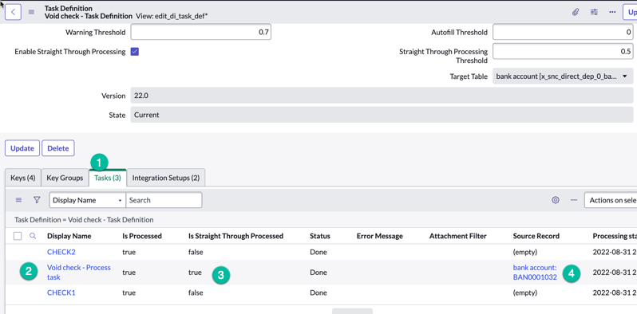

1. Once the task screen is open, notice the **Extracted Values** (1), this is the values that Document Intelligence has extracted from the VOID Check automatically.
Click on the **Show In Doctintel** button (2) to open the file in DocIntel:

    

1. Agents usually open a document in Document Intelligence to review validate the extracted value or to map extracted values to the keys. The first time you submit a task associated to a new **Task Definition**, DocIntel won't know which values go to which key. The Machine Learning model needs to be trained. We do this by clicking on the key field (1) and selecting the correct value. The sytem indicates on the screen from where the value is coming from in the document (2). 

    Notice the percentage number (73%) next to **Abel Tuter** under the **Account Holder** field (1). This is the confidence score for the prediction. The confidence score increases as you train the model with more document (usually 4 to 5 documents is enough to reach high number).  On the Task definition you can configure the **Straight Through processing threshold**. this correspond to the predicition confidence score value for which you want to extract the values and map them to the fields without a manual review from an agent.

    Click the **Submit** button.  By clicking the submit button the model is trained with those new inputs. In this Lab environment we do not have access to our Machine Learning component it won't do anything.

1. You must remember we have submitted a VOID Check as **Abel Tuter**, you might wonder how the Bank Record with attachement was picked up automtically by DocIntel. Let's review what was configured to do this. 

1. We are going return to the Task Definition for that use case. Click on **All** (1) then type **Document intelligence** in the filter navigator (2) and finally click **Task Definititions**:

    

1. Click on the **Void check - Task Definition** record to open it:

     

1. Once the **Task definition** is open, Click on the **Integration Setups** Tab.  
    This is where you go to configure DocIntel to Process task automatically when records are created or submitted with attachement on the defined **Target Table**.

    The first record **Void Check - Process task** (1), is where we have configured DocIntel to process a task based on our own condition. the second record **void check- extract values** is where we enable the workflow that is going to take the extracted values and assign them to the target fields that we have mapped when we have defined the **Keys**. Both of those workflows are created automatically by DocIntel but you can create your own if you need to perform additional steps.

    Open the record **Void check - Process task** (1) 

    

1. Under  **Conditions** (1) This is where you configure the conditions for DocIntel to process specific records (pick up attachment from specific records that match that condition). 

    The option *Create flow** (2) if selected, DocIntel will automatically create the flow that will be used to trigger to create the DocIntel task and Process it.

    **Trigger** (3) and **Flow Conditions** (4) are automatically created, this what you will see if you open the specifc Flow in Flow Designer, it correspond the the Flow trigger and flow condition in flow designer. 

    

1. We have reviewed all the configurations that was done for that particular use case.  Lets review the outcome of that automated data extraction from DocIntel.

    Click on **Favorites** (1) then **bank account table** (2)

    

    When we origninally submitted the VOID Check as **Abel Tuter** a bank record was automatically created. Then based on the configuration of DocIntel, a DocIntel task was created automatically to process the attachment (VOID Check), extract the data then update the field Account Number, Bank Name, Routing Number, Account Holder.  In this Lab we have cannot process documents since we do not have access to our shared ML Infrastructure so we are showing on this screen the end result with data we have preloaded on the lab instance so you can see what it would look like.

    

In the following  exercice (IntegrationHub we see how to build a spoke to integrate ServiceNow to an external API that will use those extracted information from DocIntel.

## Conclusion

In this **Document Intelligence** lab, you have learned how to configure a Document Intelligence to extract information from structured or semi-structed documents and use it within ServiceNow.

# Integration Hub exercice

## Introduction

Integration Hub enables execution of third-party APIs as a part of a flow when a specific event occurs in ServiceNow. These integrations, referred to as spokes, are easy to configure and enable you to quickly add powerful actions without the need to write a script. For example, you can post a message and incident details in a Slack channel when a high priority incident is created.

## Goal

In this exercice you will learn how to create a Spoke in Integration Hub. You will learn how to connect a ServiceNow Worklow to a remote API. For our use case we want to use Integration Hub to validate some data against an API. In the previous exercice we have seen how to extract data from document using our Intelligent Document Processing capability (**Document Intelligence**). In the previous exercice we see how we can extract Banking information from a VOID Check automatically using DocIntel. In this exercice we see how we validate the **Routing Number** extracted from a VOID Check by building an Integration Hub spoke action that is going to take this Routing Number information and pass it to an external API. This 3rd party API returns additional banking information that can be useful to setup the direct deposit for this new employee, or simply validate that the data extracted is correct.  This is just an example to show how easily you can connect ServiceNow to external system via API by creating your own Spoke. We see how to build an integration to an API with having to write a single line of code.

## Getting Familiar with an API

When you need to create an integration from ServiceNow to an external system via API, it is important to familiarize yourself with the API that you are going to call from ServiceNow first. In the following steps we are going to take a look at that API so we can understand how it works and create our own spoke for it:

1. Inspect the Routing Number API.

    Open a browser and navigate to https://www.routingnumbers.info/api/data.html to test out the API and analyze what this API can return.  

    On the **Routing Number** Type 02000021 (1) then Click **Get Bank Data** (2)

     

    > The number we provide as input to the API must be a valid routing number, typically this routing number is found on a VOID Check 

    Under Results you can see the information that this API returns

    > From a workflow in ServiceNow, you might want to make a call to this API to collect additional information from the Routing Number. For this you can create your own spoke.

     

    In the next step of this exercice we will leverage that API from ServiceNow, custom IntegrationHub spoke action so we can make those API calls directly from a Workflow in ServiceNow and retrieve the API Response from this third party application.

## Creating the spoke action for that Routing Number API

1. Log in to your instance
1. Click the **All** tab (1), then type **Flow Designer** (2), and finally click **Flow Designer** (3)

    
1. Click on **New** (1) then **Action** (2)

     

1. Fill in the **Action properties** form with those informations:

   | Field | Value |
   |-------|-------|
   | ActionName | Validate Banking Information |
   | Application | Direct Deposit |
   | Accessible From | All application scope |
   | Protection | None |
   | Category | leave blank |
   | Description | This Spoke action takes a routing number as an input and query a remote REST API to retrieve additional information for that routing number |
   | Action annotation | Keep default value |

    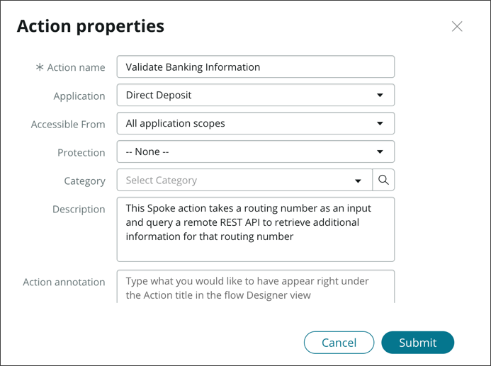
    
    Then click **Submit**.

1. Add an **Input** to the action. 

    Click **Create Input**

    

    Under **Action Input** You should see a new input line as shown in this screenshot below:

    

    Under the **Label** column, double-click **variable** to rename the label and type the value **Routing Number** then click **variable** on the next column **Name**, the **Name** should be automatically filled in with **routing_number**.

    Make the input Mandatory (1) and click **Save** (2)

    

    > We have created an input for our custom action, when someone uses our action from a workflow they will have to pass a value in that input. This value is used as a parameter when we make the API call to the remote application.

 1. Under Inputs, click on the **+** sign to add a step to our action:

    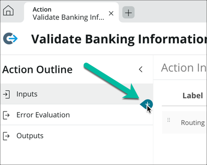

1. In the new window, type **REST** in the search box (1), then select the **REST** component (2):

    

    > Most of the spokes that ServiceNow customers or even ServiceNow build are using this REST Step. It is an easy way to configure ServiceNow to make REST API Calls to 3rd Party APIs without coding. ServiceNow provide Integration step for other protocols such as SSH, Powershell, Webservices etc.

1. Under **Connection Details** On the **Connection** field, select **Define Connection Inline** (1) then on the **Base URL** field type the url  https://www.routingnumbers.info

    

    > For this exercice we do not use any credentials, this third party API doe not require authentication but most 3rd party API would require credentials to authenticate with it.Credentials can be configured in ServiceNow, and you would select the right **Credential Alia** to use under the **Connection Details**
    In production scenario, information such as **Base URL** (End point)c and **Credentials** would be configured on the instance under **Connections & Credentials**.

1. Scroll down to show the **Request Details** form

    On the **Resource Path** field type **/api/data.json?rn=**
    then drag and drop the Routing Number from the Data pill as shown below:

    

    > In that step we are passing dynamically the value from the input we created earlier to the API.

    API Requests often time take specific Query Parameters and Headers, usually the information needed can be found in the API documentation of the third party application. For that particular example we need to pass two Headers parameters.

1. Scroll down to show the Headers section, and click the **+** sign as shown below to add a new  Header Name and Value:

    

    | Name| Value |
   |-------|-------|
   | Content-Type | application/json |

    Repeat that step to add the folling **Name** and **Value**

    | Name| Value |
   |-------|-------|
   | User-Agent | chrome |

   It should looks as shown below:

    

1. On the upper right hand side, click **Save** (1) then **test** (2).

    

1. Enter the **Routing Number**: **021000021** (1) then Click **Run test** (2):

    

    After few second the test has finished running, click on the text **Your Test has finished running. View the Action execution detail**:

   

   We can now inspect the response from the API

1. Expand the **Steps** Section

    

1. Scroll down until you see the **Response Body** (1) under the **Step Output Data**, then click on the value (2)

    

    This will open the content of the **response_body** output, this is the response coming from the API. Most APIs return a response in the same format (JSON Payload), it contains the information that we want to use from our Workflow. 
    
    > The benefit of Flow Designer and Integration Hub is that we can parse a JSON Payload without having to script anything (most solutions on the market require some kind of codind to do this), before we had Integration Hub on the plateform we had to use some json.parse function in Javascript to be able to extract information from a JSON Payload. We made it easy for anyone to build an integration with no code.

1. Copy the code from the **Viewing response_body** window: 
    > Save in a text file or notepad or make sure to keep the content in your clipboard (Copy/paste) as we are going to need it when we configure the JSON Parse step, we will use this content.

   

    > At this stage we have created the REST API Call to the 3rd Party Routing Number API, now we need to add a step to be able to parse the response from the API to retrieve the value we need.

1. Under **Rest Step** click the **+** sign to add a new step:

    

1. In the search box, type **JSON Parser** (1), then select **JSON Parser** (2) to add that step to your action:

    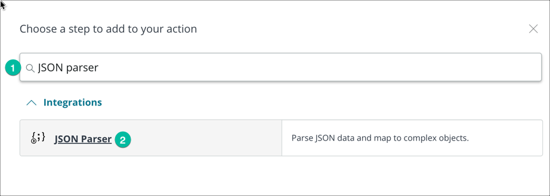

    You should have the **JSON Parser step** under the **REST step** as shown:

    
    > The first step (**REST Step**) makes the call to the remote REST API, then the second step (**JSON Parser step**) will parse the response from that API and extract the information we need. 

1. Drag and drop the **Response Body** from the Data pill to the **Source data** field on the **JSON Parser step** as shown below

    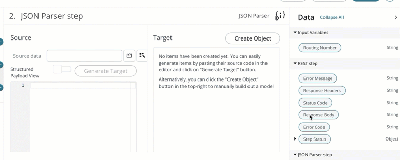

1. Past the JSON Payload (1) (from your clipboard or text file) , then click **Generate Target**:

    

1. The **JSON Parser** step generates for you the objects (instead of having to script like with most of solution out there) that have the information coming from the API Response. No need to code anything! 
    Under **Target** (1) expand the **root** object

   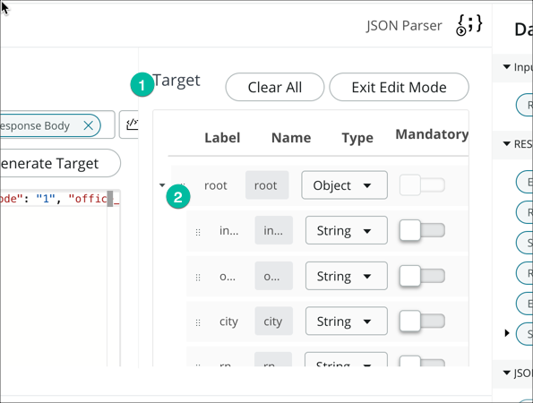

1. Now we are going create the output variable on our spoke action so anyone who use that spoke action oin their workflow can retrieve the different values from the API.
   We are going to map those Object from previous step to new Output variable. 

1. Click **Outputs**:

    

1. Then click **Create Output**:

    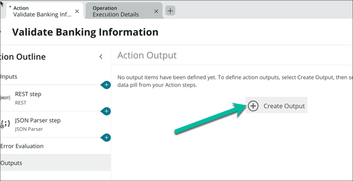
    
1. On the Label columb Double click **variable** (1) and type office_code then double click variable on the **Name** column and type office_code:
    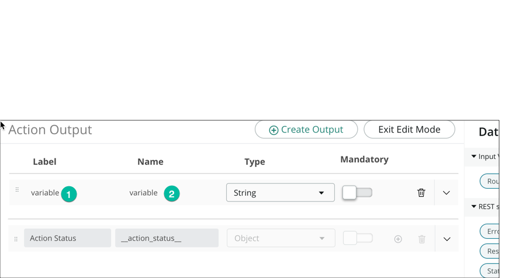

1. Then continue to **Create Output** with the following **Label** and **Name**:

    | Label| Name |
   |-------|-------|
   | zip | zip |
   | customer_name| customer_name |
   | message | message |
   | telephone | telephone |
   | state | state |
   | address | address |
   | routing_number | routing_number |

1. Verify that you have created the Ouputs as shown below:

    

1. Now that we have created the output we can map the Objects from the **JSON Parser** step to those **Action Outputs**. That way we are taking the data from the API response and assigning the values to our outputs (Variables) so anyone who use that action in a flow can use the data coming from the API in any steps of their flow.

1. Click **Exit Edit Mode**

    

1. Locate on the right hand side (Data pill) the **Jason Parser Step** section then under **root**, you see the objects coming from the API Response (JSON payload). We need to assign those variable to the **Action Outputs** we just created in the previous step.

    

1. Drag and Drop those variables from the **JSON Parser step** to the **Action Output** variable as shown:

    

    Repeat that step for the following objects:

    | JSON Parser => Root | Action Output |
   |-------|-------|
   | zip | zip |
   | customer_name| customer_name |
   | message | message |
   | telephone | telephone |
   | state | state |
   | address | address |
   | routing_number | routing_number |

1. Once you are done mapping the variables from the **JSON Parser Step** to the Action Outputs, click **Save** and review the Action Output screen to make sure it looks the same as the picture below:

      

1. Now it's time to test our new Action again to make sure the value extracted from the API response are correctly passed to our newly created Action Output. Click **Test**:

     

1. Enter the Routing Number **021000021** (1) then click **Test** (2):

    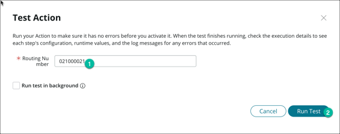

    After few second you should see the text **Your Test has finished running, View the Action execution details**. click on that text to inspect the execution detail and see if our newly Action Ouputs contain values assigned to them:

    

1. The Execution Details screen opens, scroll down until you see the **Output Data** section. 

    Congratulation! you have created a new API integration, you are capturing data from the API response and assigning those to variables that can be reused from within any workflows that use that new Action! 

    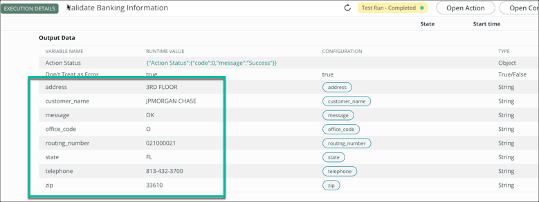

1. We have basically created a reusable building block (Spoke action). For builders to be able to use it from within their worlflows, you need to publish it to make it available. 
Close the Operation Execution Details tab(s):

    

1. Click the **Publish** button from your **Validate Banking Information** Action screen:

    

1. Click **Publish** again from this Validation screen:

    

## Creating a subflow and adding the spoke action

1. Now we are going to create a simple subflow so you can see how builders can use your new spoke action

    Click on the Home icon to return to the main screen of Flow Designer

    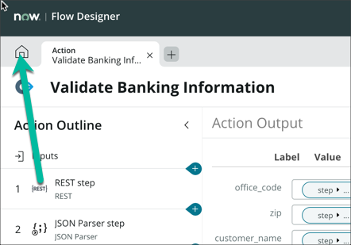

1. Click **New** (1) then **Subflow** (2):

    

1. On the **Subflow Properties** screen enter the Subflow Name **Verify Routing Number** (1), then select the Application **Direct Deposit** and finally click **Submit** (3)

    

1. We need to create an input for our subflow so a routing number can be passed from a workflow that will use that subflow. Click on the  **Select to create the inputs & outputs of your subflow**:

    

1. Under the **Inputs** section, click the **+** sign (1), then enter the label **routingnumber** (2) and name **routing number** (3), make the input **Mandatory** (4), and finally click the expand icon (5).

    

1. on the **Default value** field, type the number **02100021** (1) , then click Save (2)

    

    > We set a default value just so we do not have to type it again and again when we test the subflow.
1. Scroll down to the **Outputs** section, then click the **+** sign twice (1) to add two new output variables, and replace the variable value (2) and (3) with the value **message**, and the variable (4) and (5) with the value **bankname**, and finally click **Done** (6)

    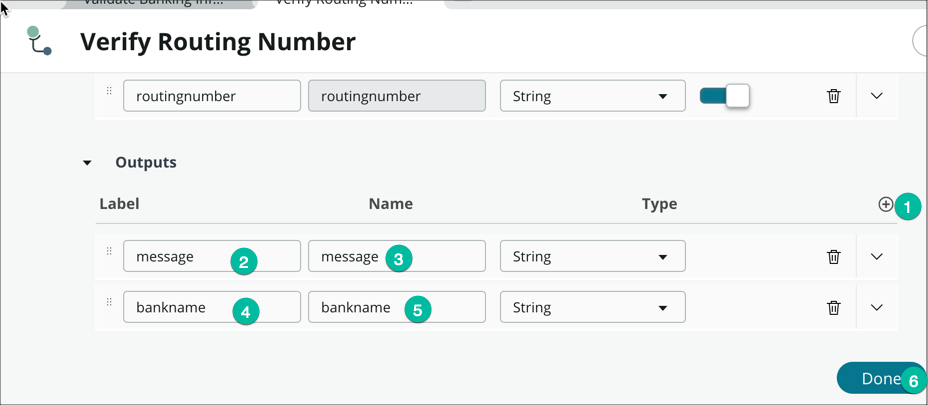

1. Now we can add our new spoke action to the subflow. Under Actions click **+ Add an Action, Flow Logic, or Subflow**

    

1. Then click Action

    

1. in the search box type **Validate Banking Information** (1) then click under **Default** on the action **Validate banking Information** (2):

    

1. From the Data Pill, under **Subflow Inputs**, grab the **routingnumber** variable and drop it to the **Routing Number** field on our **Validate Banking Information** action and click **Done**:

    

    > This is just a simple example on how to add a custome spoke action to a subflow, under that step you could add any logic you want based on your use case.

1. Notice in the data pill on the right hand side, the variable that we have available to use in our subflow, those are the output variable we have created earlier when we built the Spoke Action. Now we are going to map those to our Subflow Outputs. For this we use a **Flow logic step** that is available to us.

1. Under Under the **Validate Banking Information** action, click **+ Add an Action, Flow Logic, or Subflow**:

    

1.  Click **Flow Logic** (1) then **Assign Subflow Outputs** (2):

    
1. Click the **+** sign (1) twice to add two Subflow output assignments, then expand the list (2) on the first line of the table, and select  **message** (3):

    

1. Drag from the Data Pill the **Message** variable and drop it to the **Data field** under the **Assign Subflow outputs** steps. For the second field under **Assign Subflow Outputs**, select the Name **bankname**, then drag the variable **customer_name** from the Data pill and drop it under the Data field and click **Done**as shown:

    

    Congratulation, you have now created a reusable Subflow that leverage your custom action, this Subflow returns two values. The Message coming from the API response (return code) and the Bank Name associated to the routing number provided as an input. This example shows how you can use your custom action in a subflow and how you can select only the information you need from that action and expose the retrieved values as Subflow outputs. This makes those values available for any buiders who will use this subflow in their own Flow.

1. Click **Save** and then click **Test**.

1. Click **Run Test**
    > Do no put any value in the Routing Number field, remember, we have set a default value, so the Subflow will use the default value.

   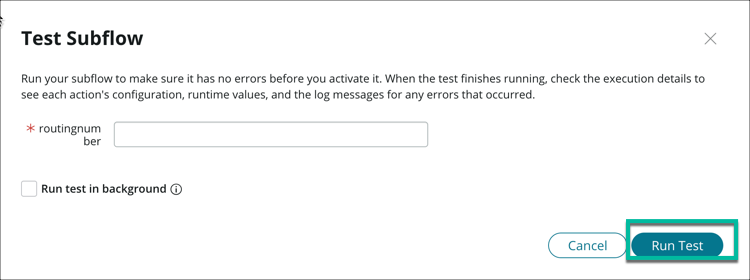

1. When the flow has finished runing, click on **Your test has finiesh running. View the Subflow execution details.**:

    

1. On the execution detail screen, expand the **Subflow Inputs & Outputs** section (1) and inspect the subflow input **routingnumber** (2) and Subflow outputs **bankname** and **message** (3)

    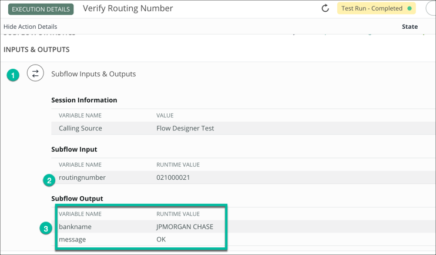

# Conclusion
You have now completed the Integration Hub exercice. We have seen how to create a new API integration by creating a new Spoke Action and using the REST and JSON Parser steps, then how to publish that spoke action to be able to use it in a subflow.
