# Introduction

Integration Hub enables execution of third-party APIs as a part of a flow when a specific event occurs in ServiceNow. These integrations, referred to as spokes, are easy to configure and enable you to quickly add powerful actions without the need to write a script. For example, you can post a message and incident details in a Slack channel when a high priority incident is created.

# Integration Hub exercice

## Goal

In this exercice you will learn how to create a Spoke in Integration Hub. You will learn how to connect a ServiceNow Worklow to a remote API. For our use case we want to use Integration Hub to validate some data against an API. In the previous exercice we have seen how to extract data from document using our Intelligent Document Processing capability (**Document Intelligent**). In the previous exercice we see how we can extract Banking informtuon from a VOID Check automatically, in this exercice we see how we can for example validate the **Routing Number** extracted from a VOID Check by building an Integration Hub that is going to take this Routing Number information and pass it to an external API. This 3rd party API returns additional banking information that can be useful to setup the direct deposit for this new employee.  This is just an example to show how easily you can connect ServiceNow to external system by creating your own Spoke. We see how to build an integration to an API with not a single line of code.

# Getting Familiar with an API

When you need to create an integration from ServiceNow to an external system via API, it is important to familiarize yourself with the API that you are going to call from ServiceNow first.

1. Inspect the Routing Number API.

    Open a browser and navigate to https://www.routingnumbers.info/api/data.html to test out the API and analyze what this API can return.  

    On the **Routing Number** Type 02000021 (1) then Click **Get Bank Data** (2)

     

    > The number we provide as input to the API must be a valid routing number, typically this routing number is found on a VOID Check 

    Under Results you can see the information that this API returns

     

    In the next step of this exercice we will leverage that API from ServiceNow, custom IntegrationHub spoke action so we can make those API calls directly from a Workflow in ServiceNow and retrieve the API Response from this third party application.

## Creating the spoke action for that Routing Number API

1. Log in to your instance
1. Click the **All** tab (1), then type **Flow Designer** (2), and finally click **Flow Designer** (3)

    
1. Click on **New** (1) then **Action** (2)

     

1. Fill in the **Action properties** form with those informations:

   | Field | Value |
   |-------|-------|
   | ActionName | Validate Banking Information |
   | Application | Direct Deposit |
   | Accessible From | All application scope |
   | Protection | None |
   | Category | leave blank |
   | Description | This Spoke action takes a routing number as an input and query a remote REST API to retrieve additional information for that routing number |
   | Action annotation | Keep default value |

    
    
    Then click **Submit**.

1. Add an **Input** to the action. 

    Click **Create Input**

    

    Under **Action Input** You should see a new input line as shown in this screenshot below:

    

    Under the **Label** column, double-click **variable** to rename the label and type the value **Routing Number** then click **variable** on the next column **Name**, the **Name** should be automatically filled in with **routing_number**.

    Make the input Mandatory (1) and click **Save** (2)

    

    > We have created an input for our custom action, when someone uses our action in a workflow they will have to pass a value in that input.

 1. Under Inputs, click on the **+** sign to add a step to our action:

    

1. In the new window, type **REST** in the search box (1), then select the **REST** component (2):

    

1. Under **Connection Details** On the **Connection** field, select **Define Connection Inline** (1) then on the **Base URL** field type the url  https://www.routingnumbers.info

    

    > For this exercice we do not use any credentials, this third party API doe not require authentication but most 3rd party API would require credentials to authenticate with it.Credentials can be configured in ServiceNow, and you would select the right **Credential Alia** to use under the **Connection Details**

1. Scroll down to show the **Request Details** form

    On the **Resource Path** field type **/api/data.json?rn=**
    then drag and drop the Routing Number from the Data pile as shown below:

    

    > In that step we are passing dynamically the value from the input we created earlier to the API.

    Api Request often time takes specific  Query Parameters and Headers, usually it the information needed can be found in the API documentation of the third party application. For that particular example we nbeed to pass two Headers parameters.

1. scroll down to show the Headers section, and click the **+** sign as shown below to add a new  Header Name and Value:

    

    | Name| Value |
   |-------|-------|
   | Content-Type | application/json |

    Repeat that step to add the folling **Name** and **Value**

    | Name| Value |
   |-------|-------|
   | User-Agent | chrome |

    

1. On the upper right hand side, click **Save** (1) then **test** (2).

    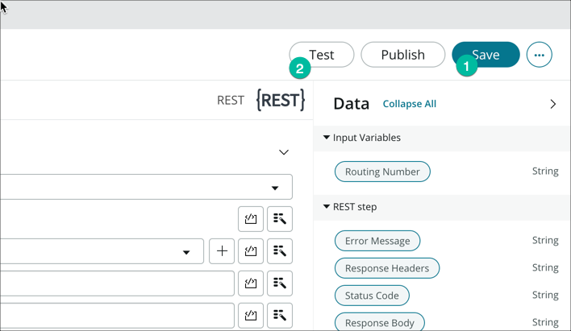

1. Enter the **Routing Number**: **021000021** (1) then Click **Run test** (2):

    

    After few second the test has finished running, clean on the text **Your Test has finished running. View the Action execution detail**:

   

   We can now inspect the response from the API

1. Expand the **Steps** Section

    

1. Scroll down until you see the **Response Body** (1) under the **Step Output Data**, then click on the value (2)

    

    This will open the content of the **response_body** output, this is the response coming from the API. Most APIs return a response in the same format (JSON Payload), it contains the information that we want to use from our Workflow. 
    
    > The benefit of Flow Designer and Integration Hub is that we can parse a JSON Payload without having to script anything (most solutions on the market require some kind of codind to do this), before we had Integration Hub on the plateform we had to use some json.parse function in Javascript to be able to extract information from a JSON Payload. We made it easy for anyone to build an intregration with no code.

1. Copy the code from the **Viewing response_body** window: 
    > Save in a text file or notepad or make sure to keep the content in your clipboard (Copy/paste)

   

    > At this stage we have created the REST API Call to the 3rd Party Routing Number API, now we need to add a step to be able to parse the response from the API to retrieve the value we need.

1. Under **Rest Step** click the **+** sign to add a new step:

    

1. In the search box, type **JSON Parser** (1), then select **JSON Parser** (2) to add that step to your action:

    

    You should have the **JSON Parser step** under the **REST step** as shown:

    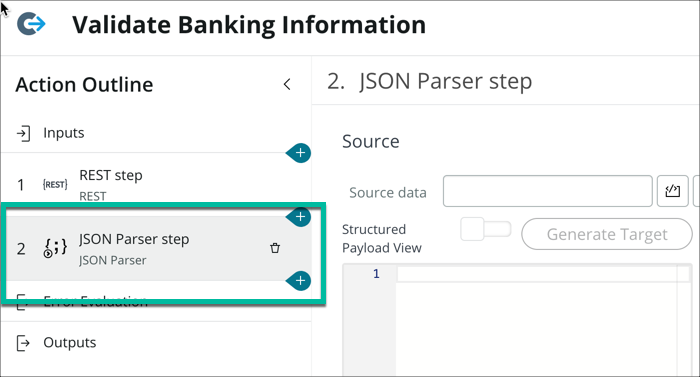
    > The first step (**REST Step**) makes the call to the remote REST API, then the second step (**JSON Parser step**) will parse the response from that API and extract the information we need. 

1. Drag and drop the **Response Body** from the Data Pile to the **Source data** field on the **JSON Parser step** as shown below

    

1. Past the JSON Payload (1) (from your clipboard or text file) , then click **Generate Target**:

    

1. The **JSON Parser** step generates for you the objects (instead of having to script like with most of solution out there) that have the information coming from the API Response. No need to code anything! 
    Under **Target** (1) expand the **root** object

   

1. Now we are going create the output variable on our spoke action so anyone who use that spoke action oin their workflow can retrieve the different values from the API.
   We are going to map those Object from previous step to new Output variable. 

1. Click **Outputs**:

    

1. Then click **Create Output**:

    
    
1. On the Label columb Double click **variable** (1) and type office_code then double click variable on the **Name** column and type office_code:
    

1. Then continue to **Create Output** with the following **Label** and **Name**:

    | Label| Name |
   |-------|-------|
   | zip | zip |
   | customer_name| customer_name |
   | message | message |
   | telephone | telephone |
   | state | state |
   | address | address |
   | routing_number | routing_number |

1. Verify that you have created the Ouputs as shown below:

    

1. Now that we have created the output we can map the Objects from the JSON Parser step to those Outputs. That way we are taking the data from the API response and assigning the values to our outputs (Variables) so anyone who use that action in a flow can use the data coming from the API to any steps of the flow.

1. Click **Exit Edit Mode**

    

1. Locate on the right hand side (Data pile), the **Jason Parser Step** then under **root**, you see the objects coming from the API Response (Json payload). We need to assign those variable to the **Action Outputs** we just created in the previous step.

    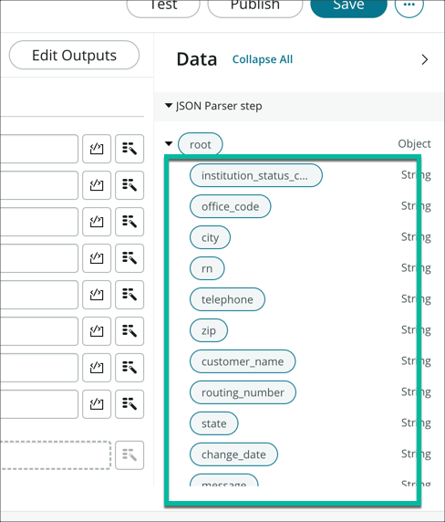

1. Drag and Drop those variables from the **JSON Parser step** to the **Action Output** variable as shown:

    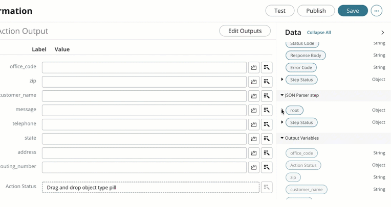

    Repeat that step for the following objects:

    | JSON Parser => Root | Action Output |
   |-------|-------|
   | zip | zip |
   | customer_name| customer_name |
   | message | message |
   | telephone | telephone |
   | state | state |
   | address | address |
   | routing_number | routing_number |

1. Once you are done mapping the variables from the **JSON Parser Step** to the Action Outputs, click **Save** and review the Action Output screen to make sure it looks the same as the picture below:

      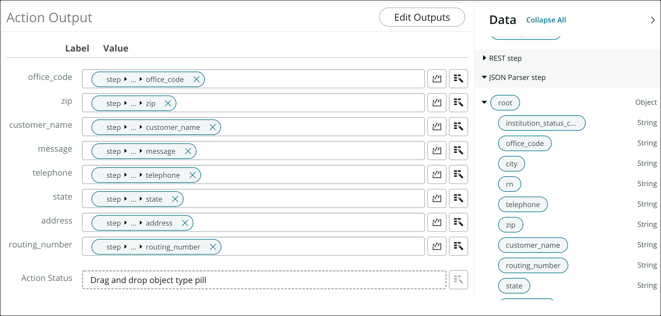

1. Now it's time to test our new Action again to make sure the value extracted from the API response are correctly passed to our newly created Action Output. Click **Test**:

     

1. Enter the Routing Number **021000021** (1) then click **Test** (2):

    

    After few second you should see the text **Your Test has finished running, View the Action execution details**. click on that text to inspect the execution detail and see if our newly Action Ouputs contain values assigned to them:

    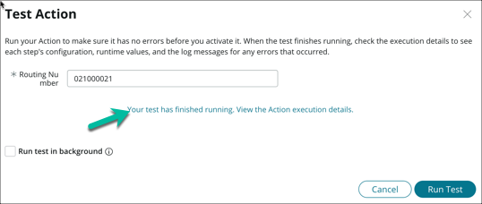

1. The Execution Details screen opens, scroll down until you see the **Output Data** section. 

    Congratulation! you have created a new API integration, you are capturing data from the API response and assigning those to variables that can be reused from within any workflows that use that new Action! 

    

1. We have basically created a reusable building block (Spoke action). For builder to be able to use it from within their worlflows, you need to publish it to make it available. 
Close the Operation Execution Details tab(s):

    

1. Click the **Publish** button from your **Validate Banking Information** Action screen:

    

1. Click **Publish** again from this Validation screen:

    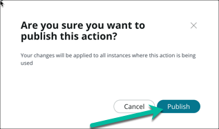

## Creating a subflow and adding the spoke action

1. Now we are going to create a simple subflow so you can see how builders can use your new spoke action

    Click on the Home icon to return to the main screen of Flow Designer

    

1. Click **New** (1) then **Subflow** (2):

    

1. On the **Subflow Properties** screen enter the Subflow Name **Verify Routing Number** (1), then Selection the Application **Direct Deposit** and finally click **Submit** (3)

    

1. We need to create input for our subflow, click on the  **Select to create the inputs & outputs of your subflow**:

    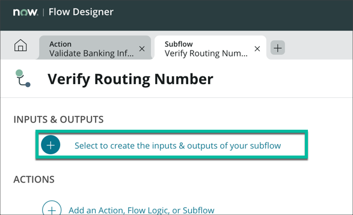

1. Under the **Inputs** section, click the **+** sign (1), then enter the label **routingnumber** (2) and name **routing number** (3), make the input **Mandatory** (4), and finally click the expand icon (5).

    

1. on the Default value, type the number **02100021** (1) , then click Save (2)

    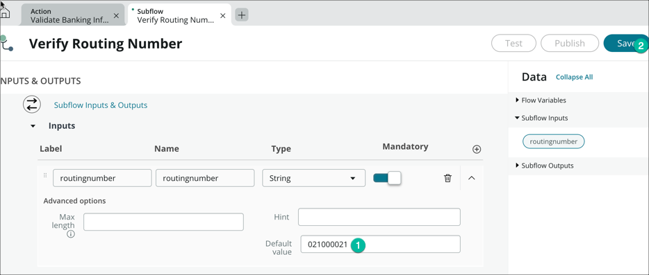

    > We set a default value just so we do not have to type it again and again when we test the subflow.
1. Scroll down to the **Outputs** section, then click the **+** sign twice (1) to add two new output variables, and replace the variable value (2) and (3) with the value **message**, and the variable (4) and (5) with the value **bankname**, and finally click **Done** (6)

    

1. Now we can add our new spoke action to the subflow. Under Actions click **+ Add an Action, Flow Logic, or Subflow**

    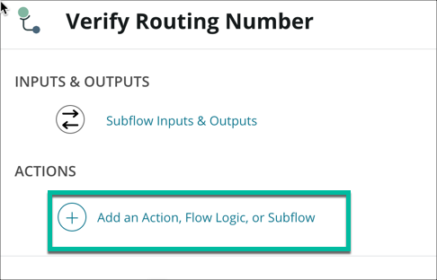

1. Then click Action

    

1. in the search box type **Validate Banking Information** (1) then click under **Default** on the action **Validate banking Information** (2):

    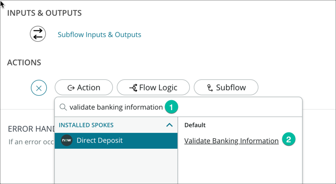

1. From the Data Pile, under **Subflow Inputs**, grab the **routingnumber** variable and drop it to the **Routing Number** field on our **Validate Banking Information** action and click **Done**:

    

    > This is just a simple exampler on how to add a custome spoke action to a subflow, under that step you could add any logic you want based on your use case.

1. Notice in the data pile on the right hand side, the variable that we have available to use in our subflow, those are the output variable we have created earlier when we built the Spoke Action. Now we are going to map those to our Subflow Outputs. For this we use a **Flow logic step** that is available to us.

1. Under Under the **Validate Banking Information** action, click **+ Add an Action, Flow Logic, or Subflow**:

    

1.  Click **Flow Logic** (1) then **Assign Subflow Outputs** (2):

    
1. Click the **+** sign (1) twice to add two Subflow output assignments, then expand the list (2) on the first line of the table, and select  **message** (3):

    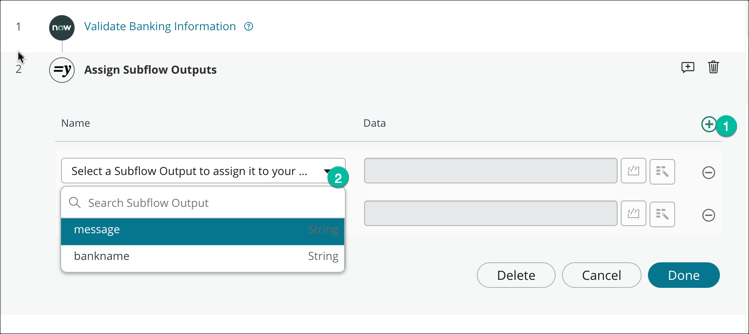

1. Drag from the Data Pile the **Message** variable and drop it to the **Data field** under the **Assign Subflow outputs** steps. For the second field under **Assign Subflow Outputs**, select the Name **bankname**, then drag the variable **customer_name** from the Data pile and drop it under the Data field and click **Done**as shown:

    

    Congratulation, you have now created a reusable Subflow that leverage your custom action, this Subflow returns 2 values. The Message coming    from the API response (return code) and the Bank Name assicated to the routing number provided as an input. This example shows how you can use your custom action in a subflow and how you can select only the information you need from that action and expose the retrieved value as Subflow outputs. This makes those value available for any buikder who will use this subflow in their own Flow.

1. Click Save and then Click Test.

1. Click Run Test
    > Do no put any value in the Routing Number field, remember we have set a default value, so the Subflow will use the default value.

   

1. When the flow has finished runing, click on **Your test has finiesh running. View the Subflow execution details.**:

    

1. On the execution detail screen, expand the **Subflow Inputs & Outputs** section (1) and inspect the subflow input **routingnumber** (2) and Subflow outputs **bankname** and **message** (3)

    

You have now completed the Integration Hub exercice. We have seen how to create a new API integration by creating a new Spoke Action and using the REST and JSON Parser steps, then how to publish that spoke action to be able to use it in a subflow.
