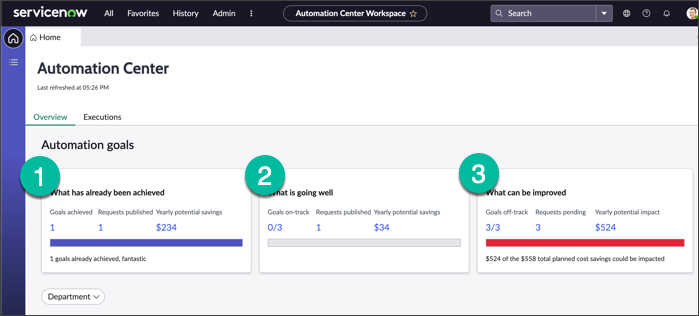
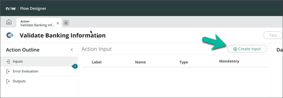
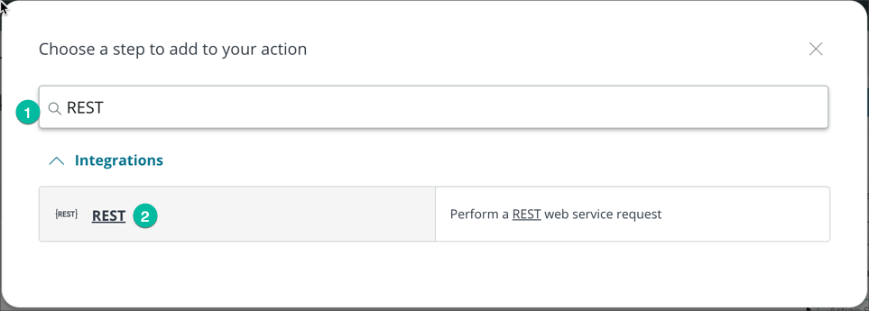
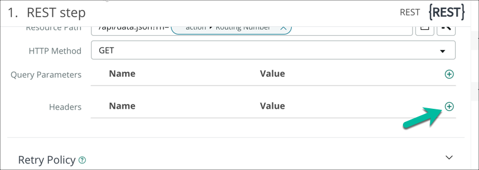
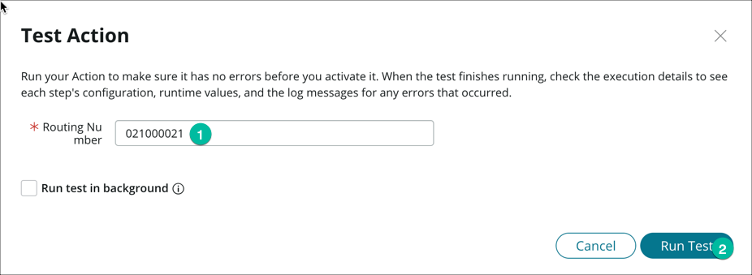
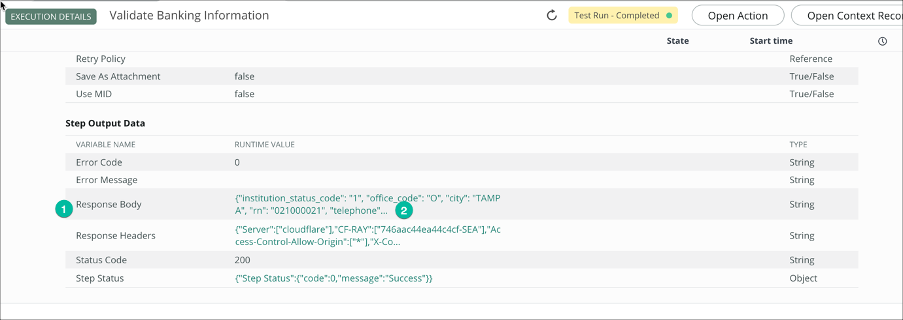
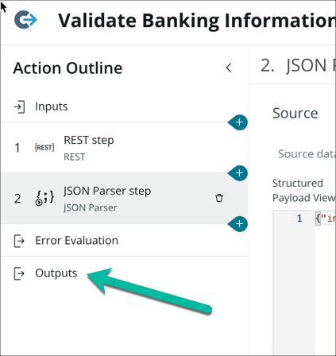

# Guidebook Template

## Goal

<!-- Replace this section with the goals of your lab/workshop -->

This document provides you with technical information and best practices to produce a Knowledge or CreatorCon lab guidebook consistent with current standards. The standards documented here must be applied to all guidebooks created or updated from the time you receive this template. In other words, you are not required to apply these to previous guidebooks unless that content is being updated for an upcoming event.

Click image below to watch the overview video:
[](https://youtu.be/rXX958QvDgw)

ServiceNow uses GitHub to store/version guidebooks and render them in HTML. For instructions on setting up VS Code and git to author your guidebook, see our [Setup Guide](https://github.com/ServiceNowEvents/Guidebook-Tools-Setup-Guide/blob/master/guidebook.md).  If you are unfamiliar with the basics of Markdown, see [Mastering Markdown](https://guides.github.com/features/mastering-markdown/) for an introduction to standard formatting.

Beyond standard Markdown, we have a few conventions you need to follow for your guidebook to render properly. This document covers the following topics: file directory structure, headings/sections, lists, images, writing style, and grammar & clarity.

Example of finished lab guide on developer.servicenow.com:


Click the image below to understand the build process:
[](https://youtu.be/uTLiXfMsuvk)

Click image below to get the details and best practices to make your lab guide zing:
[](https://youtu.be/2s_e0zvGoM4)

# Introduction

ServiceNow Automation Center integrates islands of automation and delivers centralized management of cross-enterprise automation across multiple vendors in a single workspace. Automation Center enables Now Platform owners, admins, solution architects, process analysts, and developers to view real-time metrics and analytics to understand automation performance vs. business goals, time and cost savings realized, active automations, automation pipeline, and operational health

# Exercice 1
## Goal

In this Lab 

## Review Automation Center

1. Log in to your ServiceNow instance

1. Click **All tab** (1) then type **automation center** (2), and finally click the **Automation Center Home** link (3). This will open the Automation Center Workspace.


1. Lets review the Automation Center Workspace.

The Automation Center Workspace let you review the automation automation goals: What has already been achieved (1), what is going well (2), what can be improved.(3)
The progress is shown only for the goals that are associated with a request from the current year.



<!--

    1. Create your lab guide starting here.

    2. Use the instructions below as a template
       to format your guidebook.

    3. When you are done writing your guidebook,
       remove the template instructions.     
-->


# IntegrationHub

## Goal

In this exercice you will learn how to create a Spoke in IntegrationHub. You will learn how toconnect a ServiceNow Worklow to a remote API. For our use case we want to use IntegrationHub to validate the Routing Number extracted from a VOID Check (with Document Intelligence), we are going to pass the routing number to a remote API (routingnumber.info), this allows us to perform some additional Data Validation and gather additional banking information.  This is just an example to show how easily you can connect ServiceNow to external system by creating your own Spoke.

When you need to create an integration from ServiceNow to an external system via API, it is important to familiarize yourself with the API that you are going to call from ServiceNow

1. Inspect the Routing Number API.

    Open a browser and navigate to https://www.routingnumbers.info/api/data.html to test out the API and analyze what this API can return.  

    On the **Routing Number** Type 02000021 (1) then Click **Get Bank Data** (2)

     

    > The number we provide as input to the API must be a valid routing number, typically this routing number is found on a VOID Check 

    Under Results you can see the information that this API returns

     

    In the next step of this exercice we will leverage that API from ServiceNow, custom IntegrationHub spoke action so we can make those API calls directly from a Workflow in ServiceNow and retrieve the API Response from this third party application.


## Creating the spoke action


1. Log in to your instance
1. Click the **All** tab (1), then type **Flow Designer** (2), and finally click **Flow Designer** (3)

    
1. Click on **New** (1) then **Action** (2)

     

1. Fill in the **Action properties** form with those informations:

   | Field | Value |
   |-------|-------|
   | ActionName | Validate Banking Information |
   | Application | Direct Deposit |
   | Accessible From | All application scope |
   | Protection | None |
   | Category | leave blank |
   | Description | This Spoke action takes a routing number as an input and query a remote REST API to retrieve additional information for that routing number |
   | Action annotation | Keep default value |

    
    
    Then click **Submit**.

1. Add an **Input** to the action. 

    Click **Create Input**

    

    Under **Action Input** You should see a new input line as shown in this screenshot below:

    

    Under the **Label** column, double-click **variable** to rename the label and type the value **Routing Number** then click **variable** on the next column **Name**, the **Name** should be automatically filled in with **routing_number**.

    Make the input Mandatory (1) and click **Save** (2)

    

    > We have created an input for our custom action, when someone uses our action in a workflow they will have to pass a value in that input.

 1. Under Inputs, click on the **+** sign to add a step to our action:

    

1. In the new window, type **REST** in the search box (1), then select the **REST** component (2):

    

1. Under **Connection Details** On the **Connection** field, select **Define Connection Inline** (1) then on the **Base URL** field type the url  https://www.routingnumbers.info

    

    > For this exercice we do not use any credentials, this third party API doe not require authentication but most 3rd party API would require credentials to authenticate with it.Credentials can be configured in ServiceNow, and you would select the right **Credential Alia** to use under the **Connection Details**

1. Scroll down to show the **Request Details** form

    On the **Resource Path** field type **/api/data.json?rn=**
    then drag and drop the Routing Number from the Data pile as shown below:

    

    > In that step we are passing dynamically the value from the input we created earlier to the API.

    Api Request often time takes specific  Query Parameters and Headers, usually it the information needed can be found in the API documentation of the third party application. For that particular example we nbeed to pass two Headers parameters.

1. scroll down to show the Headers section, and click the **+** sign as shown below to add a new  Header Name and Value:

    


    | Name| Value |
   |-------|-------|
   | Content-Type | application/json |

    Repeat that step to add the folling **Name** and **Value**

    | Name| Value |
   |-------|-------|
   | User-Agent | chrome |

    

1. On the upper right hand side, click **Save** (1) then **test** (2).


    


1. Enter the **Routing Number**: **021000021** (1) then Click **Run test** (2):

    


    After few second the test has finished running, clean on the text **Your Test has finished running. View the Action execution detail**:

   

   We can now inspect the response from the API

1. Expand the **Steps** Section

    

1. Scroll down until you see the **Response Body** (1) under the **Step Output Data**, then click on the value (2)

    


    This will open the content of the **response_body** output, this is the response coming from the API. Most APIs return a response in the same format (JSON Payload), it contains the information that we want to use from our Workflow. The beauty of Flow Designer and IntegrationHub is that we can parse this JSON Payload without having script anything (most solution on the market require some kind of codind to do this)

1. Copy the code from the **Viewing response_body** window: 
    > Save in a text file or notepad or make sure to keep the content in your clipboard (Copy/paste)

   

    > At this stage we have created the REST API Call to the 3rd Party Routing Number API, now we need to add a step to be able to parse the response from the API to retrieve the value we need.


1. Under **Rest Step** click the **+** sign to add a new step:

    

1. In the search box, type **JSON Parser** (1), then select **JSON Parser** (2) to add that step to your action:

    

    You should have the **JSON Parser step** under the **REST step** as shown:

    
    > The first step (**REST Step**) makes the call to the remote REST API, then the second step (**JSON Parser step**) will parse the response from that API and extract the information we need. 

1. Drag and drop the **Response Body** from the Data Pile to the **Source data** field on the **JSON Parser step** as shown below

    


1. Past the JSON Payload (1) (from your clipboard or text file) , then click **Generate Target**:

    

1. The **JSON Parser** step generates for you the objects (instead of having to script like with most of solution out there) that have the information coming from the API Response. No need to code anything! 
    Under **Target** (1) expand the **root** object

   


1. Now we are going create the output variable on our spoke action so anyone who use that spoke action oin their workflow can retrieve the different values from the API.
   We are going to map those Object from previous step to new Output variable. 

1. Click **Outputs**:

    

1. Then click **Create Output**:

    
    
1. On the Label columb Double click **variable** (1) and type office_code then double click variable on the **Name** column and type office_code:
    

1. Then continue to **Create Output** with the following **Label** and **Name**:

    | Label| Name |
   |-------|-------|
   | zip | zip |
   | customer_name| customer_name |
   | message | message |
   | telephone | telephone |
   | state | state |
   | address | address |
   | routing_number | routing_number |

1. Verify that you have created the Ouputs as shown below:

    

1. Now that we have created the output we can map the Objects from the JSON Parser step to those Outputs. That way we are taking the data from the API response and assigning the values to our outputs (Variables) so anyone who use that action in a flow can use the data coming from the API to any steps of the flow.

# File Directory Structure

## Creating your local repository

1. On your local machine, create a GitHub folder in an appropriate place (e.g. Users> Your Home> Documents).

1. Locate the **Clone or download** (green) dropdown in the GitHub repository created for you and copy the URL.

    


1. Open a command or terminal window on your local machine and clone the repistory with a command similar to this:

        git clone (pasted URL)

1. You can now edit the files locally and push them to GitHub as needed.

## Files and folders

1. Your workshop/lab guide must be named **guidebook.md**.

1. Place images in a folder named **images** (all lower case) and reference them with a relative pathname in your Markdown reference.

        

    > Note that this document makes use of absolute URLs to the images because they do not get copied with the template. As a general practice, use relative URLs in your guidebook (see images below).

1. Create an optional **files** folder for any files students need to download for the course, such as images, JavaScript, or csv files to import. The *files* directory name is lowercase.

        Download the [Sample data](files/sample_data.xlsx)

    > Note that file names with spaces will break the publishing process.  Replace spaces with underscores for file and image links.

1. Create an **other** folder for any additional files such as PowerPoints used to create complex diagrams, or presenter notes. These are not generally linked from the lab guide nor available to the students.


# Headings/Sections

## Available headings

You can use the following headings in your guidebook.

| Markdown tag | Heading level |
|----|----|
| # | Heading 1 |
| ## | Heading 2 |
| ### | Heading 3 |

> **No other headings are allowed.**

## H1 & H2 relationship

Always follow your H1 lab title immediately with an H2 section title.  This is a convention allows the import process automatically generate the table of contents and navigation (see the example figure at the top).

Use Heading 1/H1 _only_ for section titles.  All content under H1 will render as a single page when digital guidebooks are published.

Example (partial):

    # Introduction

    ## Goal

    Convert an existing expense report process from spreadsheets to a bespoke application in ServiceNow. You'll leave this lab all without writing a single piece of code!

renders this index:


and each heading 1 renders a section this:

 

## Sections

Within each Heading 1/H1 section of your lab guide, use H2 to separate the different topics or exercises.

    ## Create User Accounts

    In this section you will create users for the upcoming exercises.

    1. Navigate to **User Administration > Users**.

    1. Click **New** at the top of the list.

## Allowing Attendees to Catch Up

If your lab/workshop has exercises that depend upon each other, use ServiceNow's source control integration in Studio to allow the attendee to catch up rather than hitting a dead-end.

1. As you build your lab exercises (and guidebook), create a branch in source control as you complete each exercise. For example, create a branch "Exercise 1", with the completed first exercise. When an attendee switches to that branch, they can begin the second exercise with the first one completely done.

    > **Important!** Don't forget demo data!

1. Include the GitHub Companion update set in your CloudLabs ICE Package.

1. Provide instructions at the end of each exercise to allow any attendees who did not successfully complete the lab the ability to use GitHub companion to switch branches and continue learning.

# Lists

* While Markdown supports nesting ordered and un-ordered lists, please avoid using nested lists in your guide book.  This is to avoid conflicts with how we style (or rather, do not) nested lists on the Developer Portal.

    1. Use numbered lists for task steps. All of these steps start with *1.*

    1. You do not have to manually number each step.

        But sometimes you need paragraphs between steps.  In those cases, indent your paragraphs with a tab.

        Multiple paragraphs are OK too.

    1. And markdown will pick up numbering where you left off.

    1. Place a blank line between ordered and unordered lists for clarity. 

* Indent supporting images and text to allow numbered lists to continue

# Images

## General Image Information

This is the general form of an image tag in Markdown with alt text in [] and the URL to the image. The URL can be absolute or relative. We recommend using relative images for the guidebook (as they may be re-used for other events over the course of the year).

    

    

* Inline images must be smaller than 100 pixels wide.

* All images MUST have alternate text defined for accessibility compliance.  This is the part of the image markdown in the square brackets.  This text should describe the image in a way that allows a screen reader to provide context to someone who cannot see the image.

* DO NOT use a screenshot as a replacement for text as this is not usable for people with accessibility requirements.

    For example, do not say “configure the record as shown \<insert screenshot\>”.  You can have a screenshot showing the configured record but you must also have text outside of the screenshot to explain what to do.

* Screenshot images should have a border applied in :  1 pt, dark gray (hex #424242, dec 66,66,66) (This should be .75 px, but Snagit only supports integers and points, not pixels).

    

* Avoid entire screenshots when not needed

    Keep in mind that many guidebook users may be viewing your content using mobile devices. Full screenshots are difficult to read on a tablet or mobile phone. For example, this image of Studio is difficult to read on a desktop, let alone a small screen.

    **Bad**:

    

    Providing instructions to click *Create Application File* are not much help. Instead, take a screenshot of the area of focus *in context* (with some additional elements in the shot or partially in the shot) to help the viewer locate where you want them to focus.

    **Good**:

    

* If you find you need a full screen shot...

    There will be times when you need an entire screenshot in your lab guide. Use these sparingly - often to show a "finished product" such as a dashboard layout.

    * Make the font as large as possible

        Use your browser's zoom feature to make the font as large as possible without affecting the layout of the screen. This improves the readability.

    * Use arrows to indicate areas of focus

        If you need to draw attention to a screen element in a larger context, use an arrow and label to clearly indicate where the reader should focus.

        

* Do not exceed image width of 1024px

* When you have an image representing multiple steps, provide numeric indicators and reference them in the text

    Example:

    1. In the left column, click **Data Model** (1), then in the middle, click **Table** (2), and finally click **Create** in the lower right (3).

    

* Consider using animated GIFs to demonstrate concepts like drag and drop

    Using a tool like SnagIt, you can capture motion and create animations that demonstrate short snippets that maybe difficult to convey with a static image.

    

# Writing Style

## General

* Escape special characters in Markdown. This includes \(\)\[\]\{\}\<\>.

* Identify questions and notes with the Markdown prefix **>**

    > Note: If you get a 403 error, check your headers.

    > Question: Did the list show 5 records?

* As the learner reads your guidebook, provide them fewer details.

    For example, after you have given the six-step instructions to create a user record, you do not provide the same six steps for each additional user record. Simply give instructions such as: *Repeat steps 1-6 to create two additional user accounts for Tom Harrington, and Dory Williams.* Assume the learner is learning! This also makes it easier to maintain the guidebook should any of the details change.

* Use tables when providing repetitive data entry instructions

    Example:

    1. Fill in the New account form with the data from this table:

        | Field | Value |
        |-------|-------|
        | Name | Acme Corp |
        | Location | 333 Cliffside Rd, Tucson AZ |
        | Contact name | Wile E. Coyote |

* Add a reference section to the docs pages or other helpful material at the end of each lab exercise.

    **Reference**:

    * [Flow Designer](https://docs.servicenow.com/bundle/newyork-servicenow-platform/page/administer/flow-designer/concept/flow-designer.html)
    * [Community](https://community.servicenow.com)

* Validate all code against [technical best practices](https://developer.servicenow.com/app.do#!/catlist/technical_best_practices?v=newyork).

    Examples include:

    * Avoid dot walking to a sys_id. A reference field value *is* a sys_id, so dot-walking is redundant and costs an extra database query.

        **NO**:
        ```javascript
        var id = current.caller_id.sys_id;
        ```

        **YES**:
        ```javascript
        var id = current.getValue('caller_id');
        ```

    * Use GlideRecord getValue() instead of using dotted-notation. Using dotted-notation can return incorrect values as the dotted field is an object (making work in Service Portal frustrating) and GlideRecord is a pointer (making values in loops troublesome). getValue() also allows you to use variables for field names.

       **NO**:
        ```javascript
        var location = userGr.location;
        ```

       **YES**:
        ```javascript
        var location = userGr.getValue('location');
        ```

    * When you need to dot-walk to a reference value, use toString(). Do not use toString() in place of getValue() in the previous example.

       **NO**:
        ```javascript
        var locationID = current.caller_id.location;
        ```

       **YES**:
        ```javascript
        var locationID = current.caller_id.location.toString();
        ```

    * Use setValue() instead of dotted notation when setting a field value.

        **NO**:
        ```javascript
        incGr.state = 5;
        ```

       **YES**:
        ```javascript
        incGr.setValue('state', 5);
        ```

    * Avoid hard coding sys_ids. Use a property value, or use the setDisplayValue() method (or both) where you can. sys_ids and other hard coded strings are difficult to read and maintain.

       **NO**:
        ```javascript
        current.assignment_group = '3176fe10db4e1340cbf6d5b0cf9619cd';
        ```

       **YES**: Set a system property like:

       | Field | Value |
       |-------|-------|
       | Name | my_app.default.assignment_group | 
       | Value | Help Desk |

        ```javascript
        current.assignment_group.setDisplayValue(gs.getProperty('my_app.default.assignment_group'));
        ```

    * Use GlideRecord setLimit(1) when you only need one record to check if a record exists. This can greatly speed up queuries.

       **NO**:
        ```javascript
        var incGr = new GlideRecord('incident');
        incGr.addQuery('active', true);
        incGr.addQuery('priority', 1);
        incGr.query();

        if (incGr.next()) {
            return incGr;
        }
        ```

       **YES**:
        ```javascript
         var incGr = new GlideRecord('incident');
        incGr.addQuery('active', true);
        incGr.addQuery('priority', 1);
        incGr.setLimit(1);
        incGr.query();

        if (incGr.next()) {
            return incGr;
        }
       ```

## Emphasis

* Do not use "quotes" for emphasis.

* Use **bold** for:

    * Anything users click, type, or drag
	    * Example: Click the **Save** button.
    * Application Navigator paths
    	* Example: Use the Application Navigator to open **System Applications \> Studio**.
    * Application Explore paths
	* Example: To open an applet in Studio, use the Application Explorer to open **Mobile Studio \> Applets \> \<applet name\>**.

* Use *italics* for:

    * Application names
	    * Open the *NeedIt* application in Studio.
    * Application file names
	    * Example: Configure the *Update Record* action.
    	* Example: The *NeedIt When needed field date* Business Rule prevents creating *NeedIt* records with *When needed* field values in the past. 
    * Field names and values
	    * Example: *Name*: **Shopping List**
	    * Example: In the example, the *Starting Number* field contains a 4-digit number. 
	    * Example: When the *Active* field is *true*...
    * Related list names
	    * Example: Click the **New** button on the *HTTP Methods* related list.
    * Dialog names
    	* In the *Select Application* dialog, click the **NeedIt** link to open the *NeedIt* application for editing.

* Use \< \> around variable data or data a user selects. (Do not forget to use backslash before \< and \>.)

    * Example: To open an applet in Studio, use the Application Explorer to open **Mobile Studio \> Applets \> \<applet name\>**.
    * Example: *When needed*: **\<select any date in the future\>**

* Use ( ) for values that are automatically populated.

    * Example: *Scope*: **(This value is automatically populated)**

* Use (path \> item) for data pills.

    * Example: *Record*: **(Trigger \> NeedIt Record)**

* Use \[ \] to separate components of multi-part fields and conditions.

    * Example: *Fields*: **\[State\] \[Approved\]**
    * Example: *Condition*: **\[Short description\] \[contains\]\[printer\]**

## Numbering

Numbering renders in the proper sequence regardless of the numbers used in the markdown and restarts at H2s and parent list items. To keep things simple, begin each numbered line with a *1.* to ensure proper numbering.

For example, when adding application files to Studio, always use the same verbiage:

1. Create a UI Policy.

   1. In Studio, click the **Create Application File** button.

   1. In the *Filter...* field enter the text **UI Policy** OR select **Client Development** from the categories in the left hand pane.

   1. Select **UI Policy** in the middle pane as the file type then click the **Create** button.

1. Configure the UI Policy:

    | Field | Value |
    |-------|-------|
    | Table | **NeedIt \[x\_\<your\_company\_code\>\_needit\_needit\]** |
    | Active | **Selected (checked)** |
    | Short description | **NeedIt show or hide Other field** |

## Code

* Surround code in triple-backtick marks (\`\`\`)

    Surrounding your code in \`\`\` marks formats the code to be easily copied and pasted. Using the language inside the starting ticks makes enables keyword highlighting as well.

    ```javascript
    var incGr = new GlideRecord('incident');
    incGr.query();
    var count = incGr.getRowCount();
    ```

* If your script exceeds more than 20 lines, link to a repository or downloadable text file in the *files* folder.

# Grammar and Clarity

* For mobile instructions, use "tap" instead of "click"
    * **NO**: Click the camera icon.
    * **YES**: Tap the camera icon.

* Use "Click" or "Tap", not "Click on" or "Tap on"
    * **NO**: At the bottom of the form, click on the **Submit** button.
    * **YES**: At the bottom of the form, Click the **Submit** button.

* Avoid passive sentences. If you find yourself using words like *should* and *will*, rewrite your instructions to be more active.
    * **NO**: The form will display the number of records.
    * **YES**: The form displays the number of records.
    * **NO**: You should see a screen a list with five rows.
    * **YES**: A list with five rows is displayed.

* Avoid using *you* and other second-person pronouns in concept pages.

* NEVER use *we*, *our*, and other first-person pronouns.

* Do not use "once" to indicate continuation.

    * **NO**: Once you complete the form, click **Save**.
    * **YES**: When you have completed the form, click **Save**.

* Do NOT use contractions.

* Use the Oxford comma for this, that, and the other things.

* Log in is a verb and login is an adjective or noun. “Use the login screen to log in to your instance.”  (Notice it is not log into because the verb is ‘log in’)   Same with sign in / signin and log out / logout.

* UTILIZE should NEVER be used in our content as it means to use something not fit for purpose.  As in, “make do with”.

* Give clarity as to where someone should look for something.  
	* **NO**: Click **Save**.  
	* **YES**: In the Properties dialog, click the **Save** button.
* Do not use positional words unless required.  
	* **NO**: In the screenshot below...  
	* **YES**: In the example...

# Helpful resources

* [Podcast: Break Point - Effective Presentations with Julian Mills - Part 1 - Preperation](https://omny.fm/shows/break-point/effective-presentations-with-julian-mills-part-1-p)
* [Podcast: Break Point - Effective Presentations with Julian Mills - Part 2 - Common mistakes](https://omny.fm/shows/break-point/break-point-034)